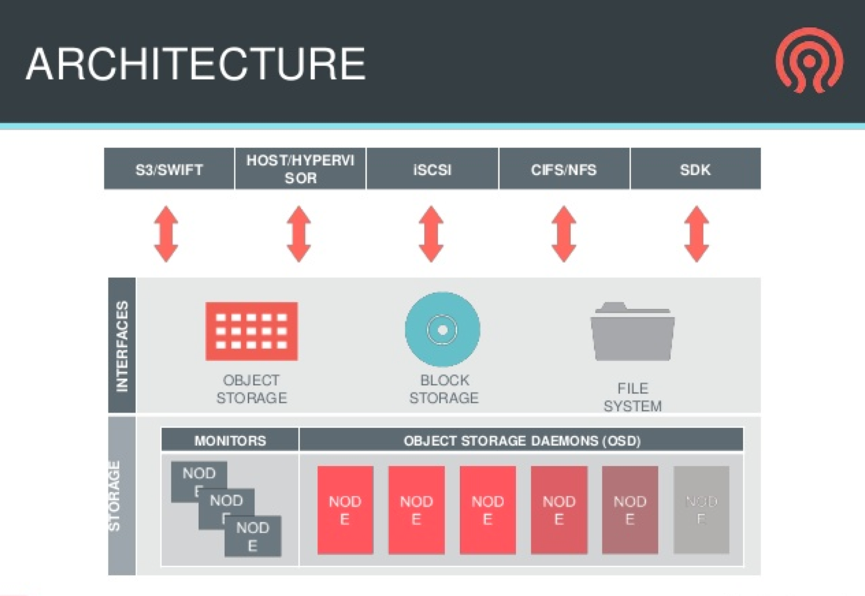
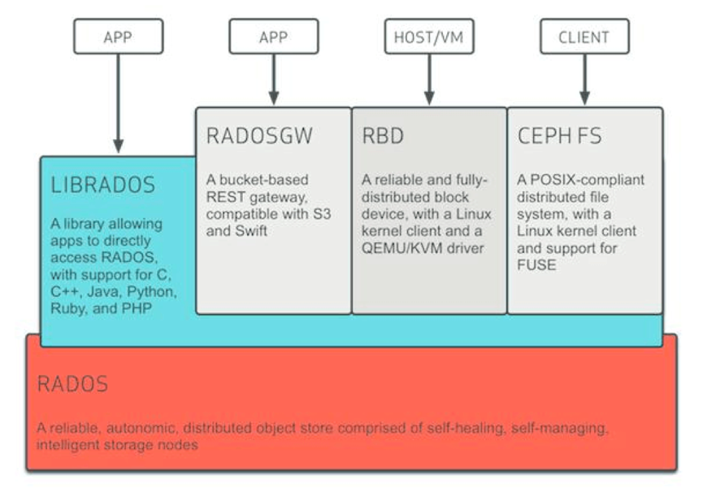
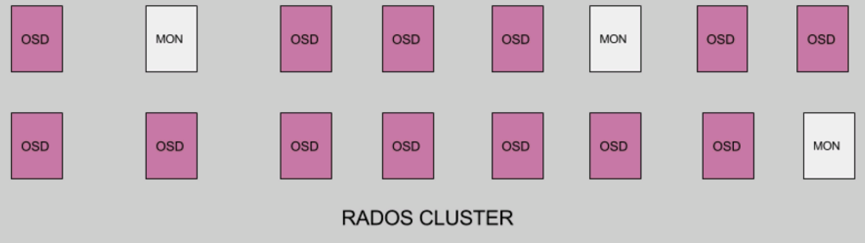

# Ceph常见概念

## 存储相关概念
### 分布式存储
分布式存储按照用途，可以分为三类:  

* 块存储: 提供块设备，常见的块存储是Ceph RBD，可以给虚拟机提供硬盘
* 对象存储: 提供文件的存储功能，常见的对象存储有S3、Ceph RGW和Swift
* 分布式文件系统: 提供文件系统，比如cephfs、glusterfs

### 存储基础知识

* SAN的全称是Storage Area Network，SAN是一种架构，SAN把外部存储设备和服务器连接起来。
* S3的全称是Simple Storage Service，是Amazon公司的对象存储类型的产品。
* Swift是OpenStack项目的对象存储类型的模块，Swift可以单独使用。
* iSCSI的全称是Internet Small Computer System Interface，用于将SCSI数据块映射成以太网数据包。它提供了在TCP/IP网络上的主机和存储设备传输数据的通道。
* SCSI的全称是Small Computer System Interface，是块数据传输传输协议，在存储行业广泛应用。

## Ceph简介
Ceph是一个PB级的存储解决方案,提供如下存储服务:

* 对象存储(RGW)
* 块存储(RBD)
* 文件系统(cephfs)

### 1.Ceph两层架构

Ceph包含两层：

* 存储层： 存储层的主要功能是管理物理存储，包括Monitors和OSD。
* 接口层： 接口层主要功能是对外提供服务，包括对象存储、块存储和文件系统三种类型的接口。

### 2.接口层架构
Ceph的逻辑架构图如下:  

Ceph包含以下组件:  

* RADOS: RADOS的全称是Reliable Autonomic Distributed Object Storage(可靠的自主分布式对象存储)，RADOS是一个完整的对象存储服务(这里的对象存储和S3或者Swift不是一个概念)，RADOS由大量的存储设备节点组成。
* LibRADOS: LibRADOS是一个Library，提供了访问RADOS的功能；RADOSGW、RBD、CephFS都会调用LibRADOS来访问RADOS。
* RBD: RBD的全称是RADOS Block Device，提供块存储。一般提供给机器作为磁盘。
* RGW(RadosGW): RGW(RadosGW)的全称是Radow Gateway，提供对象存储服务(类似于S3和Swift)。
* CephFS: CephFS是一个文件系统。

### 3.存储层(RADOS)架构
RADOS负责Ceph所有的功能，包含MON和OSD,其架构如下:  

* MON：Monitor节点
* OSD：OSD的全称是Object Storage Daemon，一般对应一块物理硬盘(建议对应到硬盘)，也可以对应一个分区。

