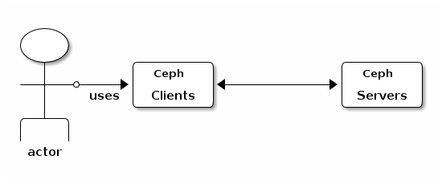

# 用户管理
在Ceph中，用户使用Ceph client和Ceph server交互，如下图:  




默认情况下，Ceph启用了身份认证；我们必须提供用户名和keyring(钥匙串，包含密钥)。如果不指定用户名，Ceph会使用client.admin作为默认的用户名。如果不指定keyring，Ceph会使用/etc/ceph下和用户名同名的keyring文件。比如，下面的命令：  

```
# ceph health
```

会被解析为：  

```
# ceph -n client.admin --keyring=/etc/ceph/ceph.client.admin.keyring health
```

其中"-n"表示client_name，即客户端的名称


对于所有的Ceph client(比如RBD、RGW或CephFS)，Ceph将数据作为对象存储在pools中。为了读写数据，Ceph的用户必须具有访问pools的权限。

## User(用户)
一个user可以是一个individual(个体)或者一个应用程序。创建用户可以让我们控制谁可以访问Ceph集群，谁可以访问哪些pools。   

Ceph中用户有一个type(类型)的属性，为了管理的目的，type通常为**client**。Ceph中用户的格式为：**TYPE.ID**，其中TYPE表示用户类型，ID为用户ID。使用type的原因是：Ceph Monitors、OSDs和Metadata Servers也使用Cephx协议，但他们不是client；使用type是为了方便把他们区分开来。

## Authorization (Capabilities)
Ceph使用术语“capabilities”(caps)来描述用户操作monitors、OSDs和metadata servers时的权限检查。  Capabilities也可以限制访问pool中的数据或者命名空间。Ceph管理员可以在创建或者更新用户的时候设置用户的Capabilities。  

## POOL(池)
池是一个顶层的逻辑分区，一般是针对不同的应用、或者应用中不同的模块建立相应的用户和池。  

比如，OpenStack使用Ceph作为后端存储时：  

* nova模块:  建立vms池
* glance模块:  建立images池，创建client.glance用户
* cinder模块: 建立volumes和backups池，创建client.cinder用户

## Namespace(命名空间)
namespace(命名空间)是池中对象的逻辑分组，池中的对象可以被关联到命名空间；一个用户的访问权限粒度可以到命名空间级别。  

但是命名空间只对位于librados上层的应用程序有用。RBD、RGW和CephFS暂时不支持这种特性。  


## 认证管理

### 查看认证列表
查看认证列表  

```
# ceph auth list
installed auth entries:
......
client.admin
	key: xxx
	caps: [mds] allow *
	caps: [mon] allow *
	caps: [osd] allow *
......
```


