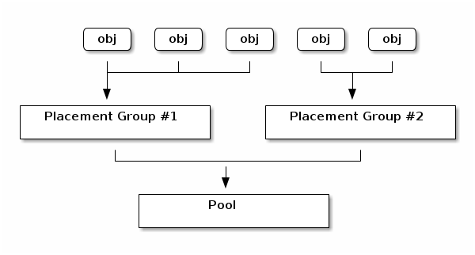

# pg数量
创建一个pool时，必须指定该pool中pg的数量，

```
# ceph osd pool create {pool-name} pg_num
```

pg的数量建议设置为2的n次方，在osd少于50个时，可以参考下面的规则设置pg数量:  

* osd数量少于5个时，pg数量设置为128
* 5-10个osd时，pg数量设置为512
* 10-50个osd时，pg数量设置为1024

当osd数量超过50个时，需要考虑多个因素确定pg的数量。


在pool中，pg将对象聚合在一起，因为追踪每个对象的成本太高了。如下图:  




Ceph客户端会计算将对象放到哪个pg中，计算方法是： 对object id做hash，然后根据pool id和pool中pg个数计算出将这个对象放到哪个pg中。  

对象所在的pg会被存储在osd集合中，osd集合的个数是pool的副本数。  


## 数据持久性
当一个osd宕掉时，在这个osd包含的数据恢复前，数据丢失的风险会增加。下面的一些场景中，某个pg中所有的数据会永久丢失:  

* osd宕掉，osd所包含的所有的数据都丢失了。在这个osd中所有的对象，副本数会减少1
* ceph开始恢复宕掉osd中的pg，选择一个新的osd创建该pg所有对象的副本


在一个ceph集群中，如果有10个osd，某个pool中有512个pg，副本数是3；CRUSH算法会给每个pg分配3个osd。因此，每个osd上pg的个数是(512*3)/10=~150。当一个osd宕掉时，会开始恢复这个osd上的约150个pg。剩余的osd会向其他osd发送对象，也会从其他osd接受对象。  

osd宕掉后，恢复的时间取决于ceph的架构。假设每个OSD都是在1TB的SSD上，并且是万兆网络，那么恢复一个osd的时间在分钟级别。


## 选择pg数量
一般情况下，让osd上pg上的数量在100个左右，根据副本数，pg数量计算公式为:  

pgs = (osd * 100)/副本数

pg的数量最好设置为2的n次方，将上面计算的数量，向上取值到最接近的2的n次方，就是pg的数量。

比如，有500个osd，副本数是3，

psg = (500 * 100) / 3 ~= 16666

大于16666最小的2的n次方的数是，32768


