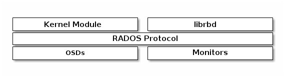

# rbd简介
block是一串连续的字节，基于block的存储是存储数据最普遍的方式，其数据读写的最小单位是block，比如硬盘、CD、软盘等。

比如查看硬盘分区的块大小:  

```
# blockdev --getbsz /dev/sdb1
512
# blockdev --getbsz /dev/sdb2
4096
```

/dev/sdb1分区的块大小是512Bytes，/dev/sdb2分区的块大小是4096Bytes.


Ceph block device的配置很精简，容量很容易扩展或变更，并且Ceph block device将数据条带化地存储在Ceph集群的多个OSD中，可以并发地读写。Ceph block device使用了RADOS的快照、副本和一致性等特点。**Ceph的RADOS Block Device(RBD)通过Linux kernel中的module或者librbd库来和OSD进行交互**，如下图:  




