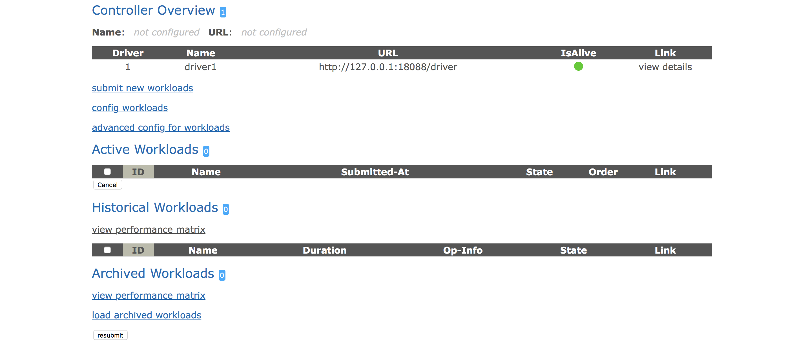

# cosbench
cosbench是对对象存储进行基准测试的工具。

github地址:  [https://github.com/intel-cloud/cosbench](https://github.com/intel-cloud/cosbench)


## 安装
cosbench使用java开发,从github上下载源码包。

```
# yum install java-1.8.0-openjdk

# wget https://github.com/intel-cloud/cosbench/releases/download/v0.4.2.c4/0.4.2.c4.zip
# unzip v0.4.2.c4.zip

# cd 0.4.2.c4/

# chmod u+x *.sh

# unset http_proxy

# ./start-all.sh
Launching osgi framwork ...
Successfully launched osgi framework!
Booting cosbench driver ...
.
Starting    cosbench-log_0.4.2    [OK]
Starting    cosbench-tomcat_0.4.2    [OK]
......
......
Successfully started cosbench driver!
Listening on port 0.0.0.0/0.0.0.0:18089 ...
Persistence bundle starting...
Persistence bundle started.
----------------------------------------------
!!! Service will listen on web port: 18088 !!!
----------------------------------------------

======================================================

Launching osgi framwork ...
Successfully launched osgi framework!
Booting cosbench controller ...
.
Starting    cosbench-log_0.4.2    [OK]
......
......
Starting    cosbench-controller-web_0.4.2    [OK]
Successfully started cosbench controller!
Listening on port 0.0.0.0/0.0.0.0:19089 ...
Persistence bundle starting...
Persistence bundle started.
----------------------------------------------
!!! Service will listen on web port: 19088 !!!
----------------------------------------------
```

查看18088和19088是否在监听:

```
# ss -ntpl | grep java
LISTEN     0      100          *:19088                    *:*                   users:(("java",pid=18306,fd=88))
LISTEN     0      50           *:19089                    *:*                   users:(("java",pid=18306,fd=18))
LISTEN     0      100          *:18088                    *:*                   users:(("java",pid=18137,fd=101))
LISTEN     0      50           *:18089                    *:*                   users:(("java",pid=18137,fd=18))
```

在浏览器中打开: http://ip:19088/controller/index.html


如下图:




## 作业管理

### 提交作业

```
# ./cli.sh submit conf/workload-config.xml
Accepted with ID: w1
```

### 查看作业信息

```
# ./cli.sh info
Drivers:
driver1	http://127.0.0.1:18088/driver
Total: 1 drivers

Active Workloads:
w1 PROCESSING	s2-prepare
Total: 1 active workloads

```

## 异常

1.启动失败

启动时失败,错误信息如下:

```
# ./start-all.sh
Launching osgi framwork ...
Successfully launched osgi framework!
Booting cosbench driver ...
Ncat: Connection refused.
.Ncat: Connection refused.
```

查看日志,如下:

```
# tail -f log/driver-boot.log
Error: Could not find or load main class org.eclipse.equinox.launcher.Main

```

原因: 下载了错误的文件,在https://github.com/intel-cloud/cosbench/releases页面下载,而不是在github代码页下载。


