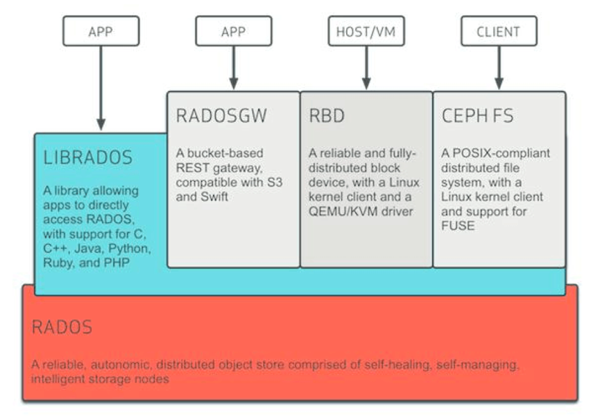
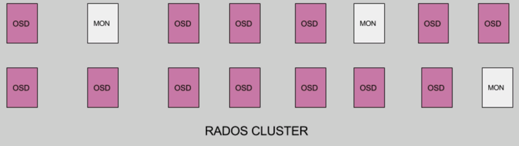
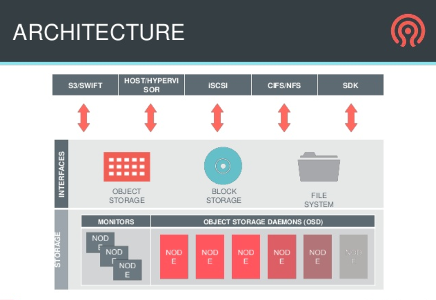
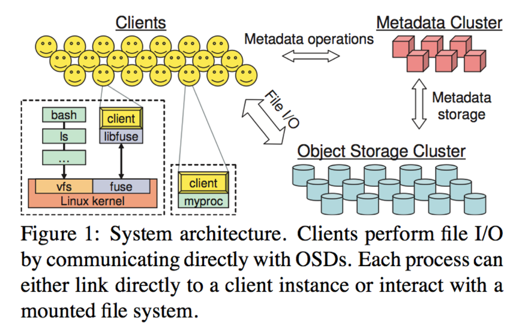
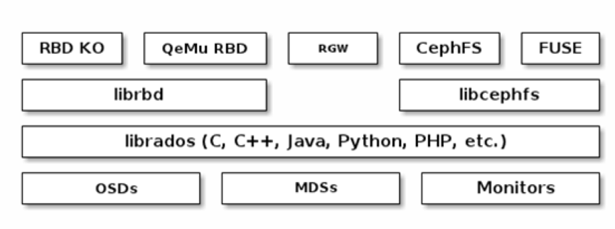
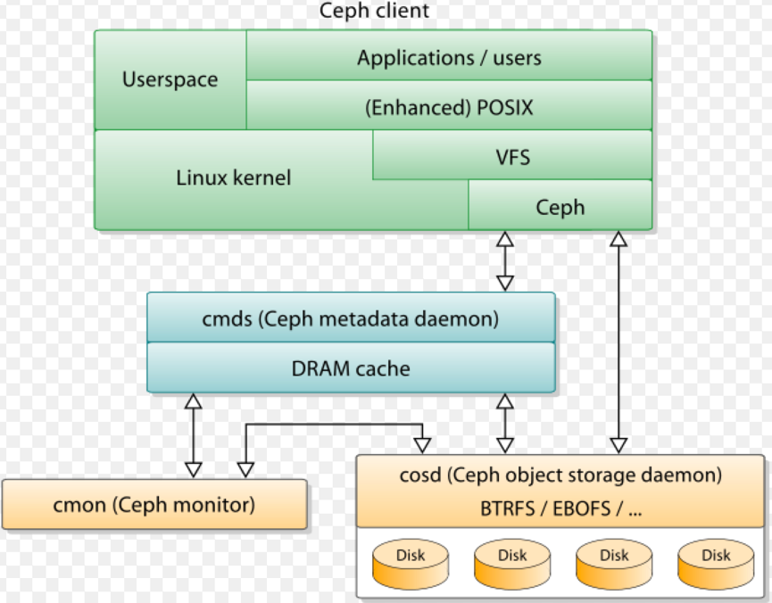
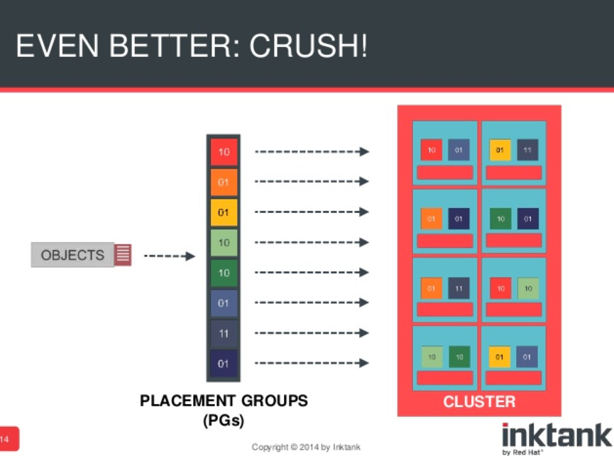

# Ceph运维笔记
主要内容:

* Ceph的安装、配置
* Ceph常用命令
* Ceph的性能测试和压力测试工具及方法
* Ceph的监控和日志管理
* Ceph性能指标及优化

# ceph简介
Ceph是一个PB级的存储解决方案,提供如下存储服务:

* 对象存储
* 块存储
* 文件系统

## 架构图1

### RADOS
RADOS的全称是Reliable Autonomic Distributed Object Storage(可靠的自主分布式对象存储)，RADOS是一个完整的对象存储服务(这里的对象存储和S3或者Swift不是一个概念)，RADOS由大量的存储设备节点组成。  

### LibRADOS
LibRADOS是一个Library，提供了访问RADOS的功能；RADOSGW、RBD、CephFS都会调用LibRADOS来访问RADOS。

### RBD
RBD的全称是RADOS Block Device，提供块存储。一般提供给机器作为磁盘。

### RGW(RadosGW)
RGW(RadosGW)的全称是Radow Gateway，提供对象存储服务(类似于S3和Swift)。

### CephFS
CephFS是一个文件系统。

## 架构图2-RADOS集群

RADOS负责Ceph所有的功能，包含MON和OSD：

* MON：Monitor节点
* OSD：OSD的全称是Object Storage Daemon，一般对应一块物理硬盘(建议对应到硬盘)，也可以对应一个分区。

## 架构图3-两层结构
  

Ceph包含两层：

* 存储层： 存储层的主要功能是管理物理存储，包括Monitors和OSD。
* 接口层： 接口层主要功能是对外提供服务，包括对象存储、块存储和文件系统三种类型的接口。

## 架构图(其他)
  
----分割线
  
----分割线
  
----分割线
  

